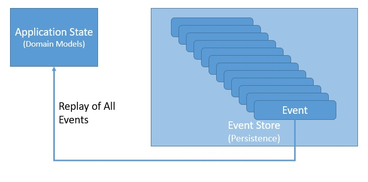
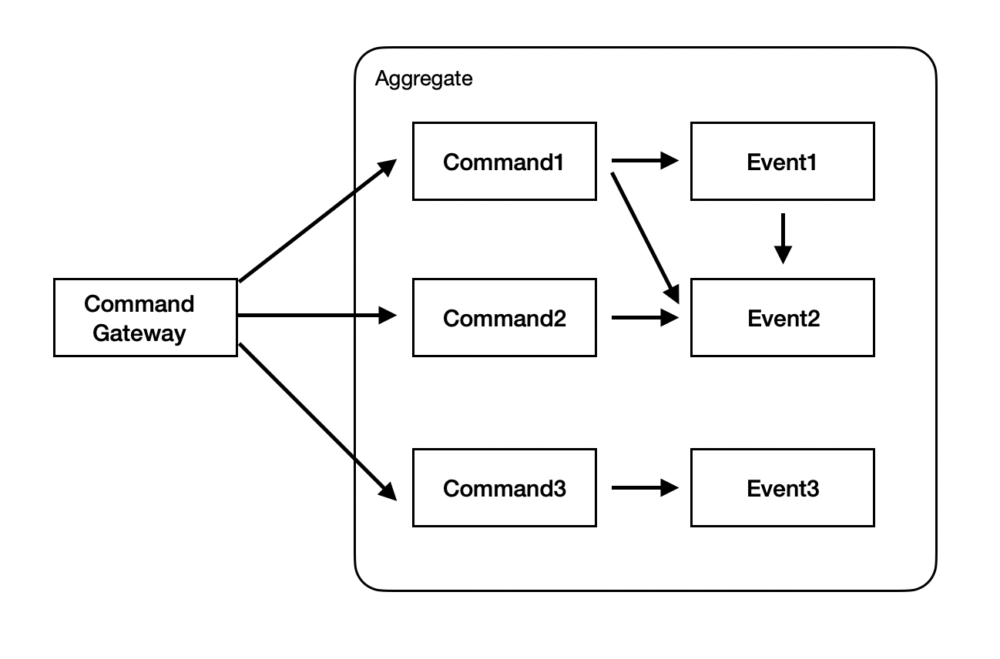
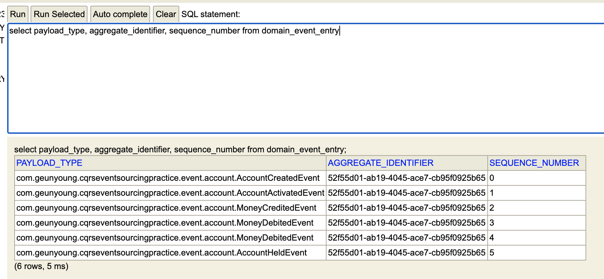

# cqrs-eventsourcing-practice

## event sourcing ?

이벤트 소싱은 영속 데이터를 어떤 식으로 저장할 것인지에 관한 것으로, 전통적인 데이터 저장 방법은 현실 세계의 것들을 직접적으로 표현하고 있는 도메인 객체(혹은 DB layer와 domain layer 사이의 간극을 해소하기 위한 DTO 객체)를 db에 담는 방식이었다. 이러한 방식은 직관적이어서 이해하기 쉽다는 장점이 있지만, 항상 도메인 객체의 최종 상태만을 담고 있기 때문에 변경된 기록을 정확하게 추적할 수 없고, 한 데이터에 대해 검색 및 변경 요청이 빈번하게 발생하기 때문에 동시성 문제를 갖고 있다는 단점이 존재한다.

반면 이벤트 소싱 방식은 도메인 객체를 생성하고, 상태를 변경하기 위해 발생하는 이벤트(event)들을 db에 저장함으로써 위에 언급한 문제들의 해결을 시도한다. 이벤트 소싱 방식에서는 도메인 객체에 대한 변경 이벤트를 모두 추적할 수 있으며, 이벤트는 한 번 발생한 이후 수정되지 않기 때문에 update나 delete 없이 항상 insert 작업만 일어난다. 따라서 동시성 문제로부터 비교적 자유롭다.



## CQRS (command query responsibility segregation)

그렇다면 이벤트 소싱 방식에서 질의(query)에 대한 응답은 어떻게 이루어질까? 질의란 데이터를 변경하지 않고 현재 데이터의 상태를 조회하는 요청을 뜻한다. 실제 db에 담겨 있는 데이터는 이벤트들의 집합이므로, 이 이벤트들을 시간 순서대로 실행하고 나면 최종적인 도메인 데이터를 얻을 수 있다. 하지만 조회 요청이 들어올 때마다 쌓여있는 이벤트들을 모두 실행시키는 것은 너무나 비효율적이므로, 도메인 데이터의 조회에 대한 새로운 모델이 필요해보인다. 이러한 맥락에서 이벤트 소싱 패턴은 명령(command)와 질의(query)의 책임을 분리하는 패턴인 CQRS 패턴과 잘 어울린다.

## Axon framework

axon framework는 DDD 패러다임 하에서 event sourcing과 CQRS 패턴을 이용해 애플리케이션을 작성할 수 있도록 도와주는 framework이다. 이번 실습에서는 axon framework과 spring boot를 사용해 cqrs 및 event sourcing 방식의 application을 만들어보려고 한다.

이번에 진행한 실습은 [여기](https://medium.com/@berkaybasoz/event-sourcing-and-cqrs-with-axon-and-spring-boot-part-1-6d1c1d4d054e) 에 소개된 방식을 따라 진행했다.

## package structure

패키지 구조는 아래와 같다.

```
src/main/kotlin/com/geunyoung/cqrseventsourcingpractice
├── command
├── config
├── controller
├── domain
├── dto
├── event
├── repository
└── service
```

### command

CQRS 패턴에서 사용하게 될 command들을 정의한 패키지. 모든 command는 아래와 같은 BaseCommand를 상속하여 작성했다.

```kotlin
open class BaseCommand<T> (
        @TargetAggregateIdentifier
        open val id: T
)
```

`@TargetAggregateIdentifier` annotation은 commandGateway가 적절한 aggregate id를 가진 instance에 해당 command를 실행할 수 있도록 해준다.

### event

event는 위에서 언급했듯이 도메인 객체에 적용되는 여러 변경사항들을 나타내고, 이벤트 소싱 패턴에서는 이 이벤트들을 db에 저장한다. 이 또한 command와 같이 BaseEvent를 정의하여 이 클래스를 상속하도록 했는데, 이렇게 함으로써 손쉽게 query를 구현할 수 있다. (뒷부분에 설명)

```kotlin
open class BaseEvent<T> (
        open val id: T
)
```

### domain

domain 패키지의 하위 구조는 아래와 같이 만들었다.

```
src/main/kotlin/com/geunyoung/cqrseventsourcingpractice/domain
├── aggregate
│   └── AccountAggregate.kt
└── entity
    └── AccountQueryEntity.kt
```

aggregate는 DDD에서 맨 처음 등장한 개념으로, 밀접한 관련이 있는 도메인 객체들을 하나로 묶은 것이다. event sourcing에서 event란 구체적으로 domain event를 뜻하는데, axon framework는 aggregate를 단위로 domain event를 db에 저장할 수 있도록 기능을 제공한다. 이 aggregate 객체에 해당 도메인 영역에 대한 핵심 비즈니스 로직이 모여있게 된다.

entity는 query를 위한 entity로, 해당 실습에서는 event store 뿐만 아니라 query를 위한 db도 따로 두어 command가 발생할 때마다 해당 aggregate의 query entity를 업데이트해주는 방식으로 CQRS의 query 파트를 구현하였다.

## Command가 작동하는 방식

request -> controller -> service까진 기존의 방식과 똑같다. service 객체는 commandGateway를 주입받는데, 이 객체는 아래와 같이 command를 `@CommandHandler` annotation이 붙은 함수로 넘겨주는 게이트웨이 역할을 한다. 그리고 commandHandler 함수는 event를 발생시켜 최종적으로는 `@EventHandler` annotation이 붙은 함수로 비즈니스 로직 수행에 대한 책임을 위임한다.



(맥북 초보자가 pages로 그린 그림 ..)

```kotlin
    override fun createAccount(accountCreateDto: AccountCreateDto): CompletableFuture<String> {
        return commandGateway.send(CreateAccountCommand(
                UUID.randomUUID().toString(),
                accountCreateDto.startingBalance,
                accountCreateDto.currency
        ))
    }


    @CommandHandler
    constructor(createAccountCommand: CreateAccountCommand) {
        this.id = createAccountCommand.id
        AggregateLifecycle.apply(AccountCreatedEvent(createAccountCommand.id, createAccountCommand.accountBalance, createAccountCommand.currency))
    }

    @EventSourcingHandler
    fun on(accountCreatedEvent: AccountCreatedEvent) {
        this.id = accountCreatedEvent.id
        this.accountBalance = accountCreatedEvent.accountBalance
        this.currency = accountCreatedEvent.currency
        this.status = "CREATED"

        AggregateLifecycle.apply(AccountActivatedEvent(this.id, "ACTIVATED"))
    }
```

애플리케이션 내의 핵심 비즈니스 로직과 강하게 결합되어 있는 commandHandler 및 eventSourcingHandler 함수들은 aggregate 객체 내에 위치하게 된다.

## Query가 작동하는 방식

event sourcing은 도메인 객체가 아닌 도메인 객체에 가해지는 이벤트들을 저장하는 방식이고, 도메인 객체의 최종적인 상태를 조회하기 위해서는 추가적인 전략이 필요하다. 이번 실습에서는 aggregate에 대응하는 query entity를 만들어, 해당 aggregate 내에서 event가 발생할 때마다 이 query entity를 업데이트해주는 방식으로 데이터의 최종 상태를 유지할 수 있도록 하였다.
그렇게 하기 위한 방법으로, 해당 aggregate가 상속하고 있는 공통된 base event에 대한 EventSourcingHandler를 만들어 이 함수에서 query entity를 업데이트하도록 했다.

```kotlin
    @EventSourcingHandler
    fun on(event: BaseEvent<String>) {
        persistAccount(buildQueryAccount(getAccountFromEvent(event)))
    }

    private fun getAccountFromEvent(event: BaseEvent<String>): AccountAggregate {
        return accountAggregateEventSourcingRepository.load(event.id).wrappedAggregate.aggregateRoot
    }

    private fun findExistingOrCreateQueryAccount(id: String): AccountQueryEntity {
        return if(accountRepository.findById(id).isPresent) accountRepository.findById(id).get()
        else AccountQueryEntity()
    }

    private fun buildQueryAccount(accountAggregate: AccountAggregate): AccountQueryEntity {
        val accountQueryEntity = findExistingOrCreateQueryAccount(accountAggregate.id)

        accountQueryEntity.id = accountAggregate.id
        accountQueryEntity.accountBalance = accountAggregate.accountBalance
        accountQueryEntity.currency = accountAggregate.currency
        accountQueryEntity.status = accountAggregate.status

        return accountQueryEntity
    }

    private fun persistAccount(accountQueryEntity: AccountQueryEntity) {
        accountRepository.save(accountQueryEntity)
    }
```

이렇게 하는 방식의 단점은 query를 위한 데이터를 따로 저장해두기 때문에 앞서 말한 기존 방식의 동시성 문제에 똑같이 노출되어있다는 점이다. 또한 event를 저장함과 동시에 query를 업데이트하는 작업도 하기 때문에 disk I/O 작업이 많아져 성능 저하의 우려가 있다.

query 요청을 효율적으로 수행하기 위해 어떤 방식이 주로 사용되는지에 대해서 조금 더 알아봐야 할 것 같다.

## 테스트

이번 실습에서는 swagger를 사용해 간단하게 테스트를 진행해보았다.

### 이벤트 저장

domain event는 axon framework에 의해 생성된 domain_event_entry라는 테이블에 담기게 된다. 아래와 같은 일련의 command request를 보낸 후 해당 테이블에 저장된 내용을 확인해보았다.

1. credit이 20$인 account를 생성
2. 해당 account에 30$를 credit
3. 해당 account에 40$를 debit
4. 해당 account에 20$를 debit



의도한 대로 해당 aggregate instance에 대해 발생한 event들이 잘 저장된 것을 확인할 수 있다. 참고로, 해당 테이블은 aggregate_identifier와 sequence_number 조합에 대해 unique contstraint가 설정되어 있다.

### query 조회

CQRS 패턴의 query 부분에서 제공해야 하는 정보는 어떤 aggregate에 대한 event의 목록과, 어떤 aggregate의 최종적인 현재 상태이다. 이 두 정보를 잘 보내주는지 테스트해보았다.

#### 1. event list
```
curl -X GET "http://localhost:8080/bank-accounts/52f55d01-ab19-4045-ace7-cb95f0925b65/events" -H "accept: */*"

[
  {
    "id": "52f55d01-ab19-4045-ace7-cb95f0925b65",
    "accountBalance": 20,
    "currency": "USD"
  },
  {
    "id": "52f55d01-ab19-4045-ace7-cb95f0925b65",
    "status": "ACTIVATED"
  },
  {
    "id": "52f55d01-ab19-4045-ace7-cb95f0925b65",
    "creditAmount": 30,
    "currency": "USD"
  },
  {
    "id": "52f55d01-ab19-4045-ace7-cb95f0925b65",
    "debitAmount": 40,
    "currency": "USD"
  },
  {
    "id": "52f55d01-ab19-4045-ace7-cb95f0925b65",
    "debitAmount": 20,
    "currency": "USD"
  },
  {
    "id": "52f55d01-ab19-4045-ace7-cb95f0925b65",
    "status": "HOLD"
  }
]
```

#### 2. domain data

```
curl -X GET "http://localhost:8080/bank-accounts/52f55d01-ab19-4045-ace7-cb95f0925b65" -H "accept: */*"

{
  "id": "52f55d01-ab19-4045-ace7-cb95f0925b65",
  "accountBalance": -10,
  "currency": "USD",
  "status": "HOLD"
}
```

음.. 잘되는군

## 정리

axon과 spring boot를 이용해 CQRS 및 이벤트 소싱 패턴을 학습해보았다. 해당 패턴들은 MSA 구조에서 활용될 때 더 큰 시너지를 내는 것으로 알고 있다. 다음 실습 때는 MSA 구조 하에서 SAGA pattern을 이용해 분산 트랜잭션을 구현해보는 방법을 학습해볼 것이다.